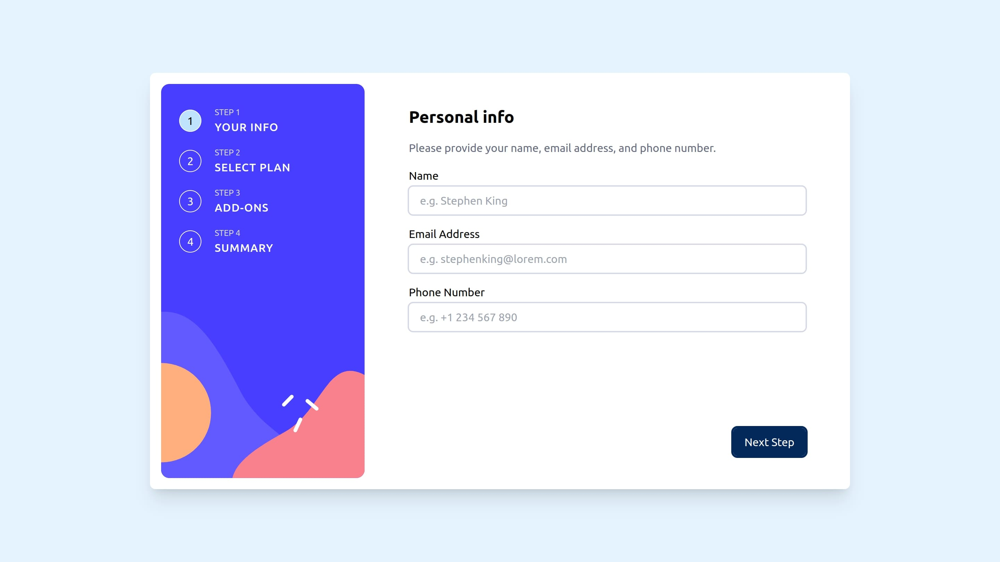
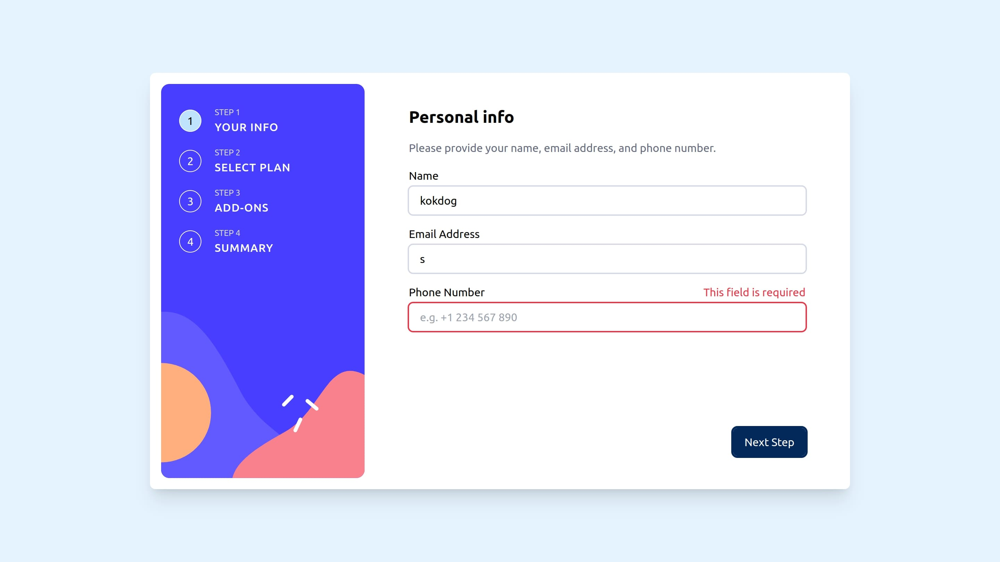
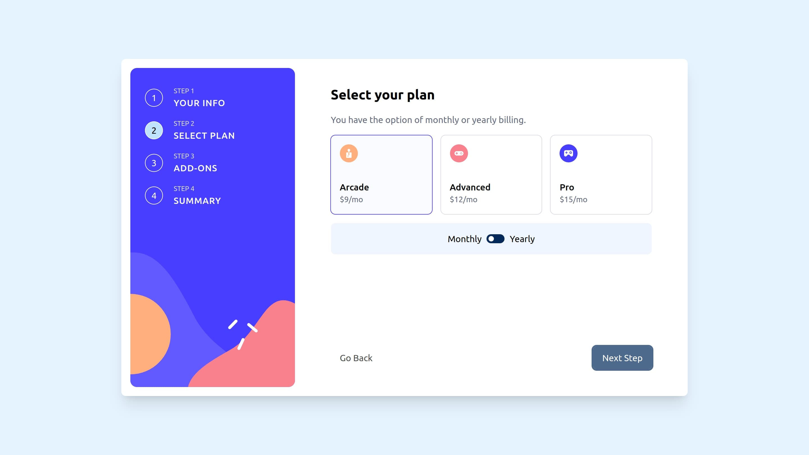
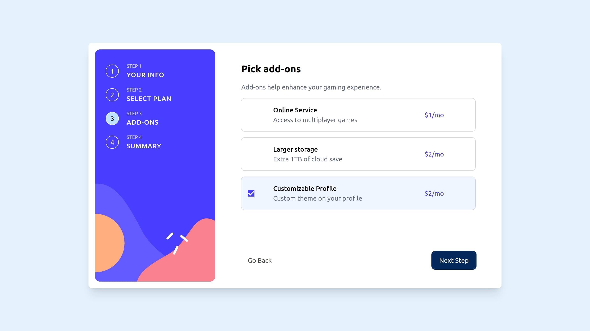
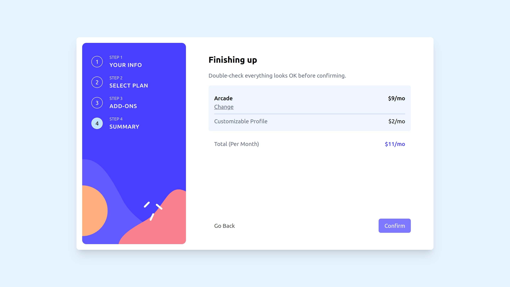
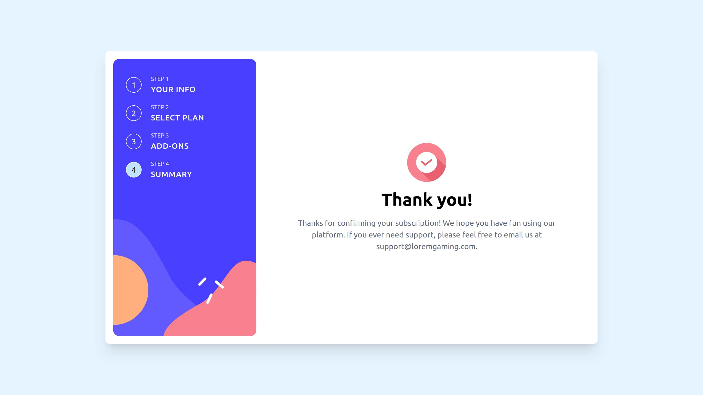

# Frontend Mentor - Multi-step form solution

This is a solution to the [Multi-step form challenge on Frontend Mentor](https://www.frontendmentor.io/challenges/multistep-form-YVAnSdqQBJ). Frontend Mentor challenges help you improve your coding skills by building realistic projects.

## Table of contents

- [Overview](#overview)
  - [The challenge](#the-challenge)
  - [Screenshot](#screenshot)
  - [Links](#links)
- [My process](#my-process)
  - [Built with](#built-with)
  - [What I learned](#what-i-learned)
  - [Continued development](#continued-development)
  - [Useful resources](#useful-resources)
- [Author](#author)

## Overview

### The challenge

Users should be able to:

- Complete each step of the sequence
- See a summary of their selections on the final step and confirm their order
- View the optimal layout for the interface depending on their device's screen size
- See hover and focus states for all interactive elements on the page

### Screenshot








### Links

- Solution URL: [Github Repo](https://github.com/rudimediaz/fem-multistep-form)
- Live Site URL: [Live Site](https://rudhifemmultiform.netlify.app/)

## My process

### Built with

- Semantic HTML5 markup
- CSS custom properties
- Flexbox
- CSS Grid
- Mobile-first workflow
- [Svelte](https://svelte.dev/) - JS library
- [Sveltekit](https://kit.svelte.dev/) - React framework
- [Tailwindcss](https://tailwindcss.com/) - For styles

### What I learned

Mechanism of moving between step is done by using 'Doubly Linked List' data structure. So it keeps the reference of next and previous.

```js
/**
 * @template T
 * @typedef {Object} StepNode
 * @property {T} value
 * @property {StepNode<T> | null} next
 * @property {StepNode<T> | null} prev
 */

/**
 * @template T
 * @typedef {StepNode<T> | undefined | null} MaybeStepNode
 */

/**
 * @template T
 * @param {T} value
 *
 */
function createNode(value) {
	let prev = null;
	let next = null;

	return /** @type {StepNode<T>} */ ({
		value,
		prev,
		next
	});
}
/**
 * @template T
 */
function createLink() {
	let size = 0;
	/** @type {MaybeStepNode<T>} */
	let head;
	/** @type {MaybeStepNode<T>} */
	let tail;

	return /** @type {const} */ ({ add, getStep });

	/**
	 * @param {T} value
	 */
	function add(value) {
		const entry = createNode(value);

		if (size) {
			tail.next = entry;
			entry.prev = tail;
			tail = entry;
		} else {
			head = entry;
			tail = entry;
		}

		size++;
		return entry;
	}
	/**
	 *
	 * @param {number} pos
	 */
	function getStep(pos) {
		let current = head;
		const _size = size;

		let count = 1;
		const msg = 'fail';

		if (_size === 0 || pos < 1 || pos > _size) {
			throw new Error(msg);
		}

		while (count < pos) {
			current = current.next;
			count++;
		}

		return /** @type {StepNode<T>} */ (current);
	}
}

/**
 * @template T
 * @param {T[]} items
 */
export function createLinkFromArray(items) {
	/** @type {ReturnType<typeof createLink<T>} */
	const link = createLink();

	for (const item of items) {
		link.add(item);
	}

	return link;
}
```

### Continued development

Tell me what i miss.

### Useful resources

- [Doubly Linked List Reference](https://code.tutsplus.com/articles/data-structures-with-javascript-singly-linked-list-and-doubly-linked-list--cms-23392) - This helped me for manage step.

## Author

- Frontend Mentor - [@rudimediaz](https://www.frontendmentor.io/profile/rudimediaz)
- Twitter - [@rudimediaz](https://www.twitter.com/rudimediaz)
